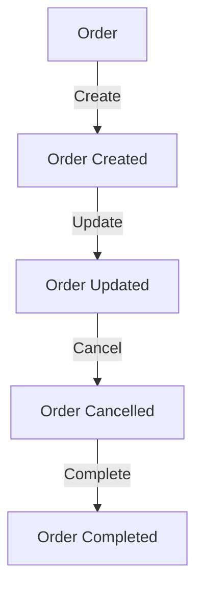
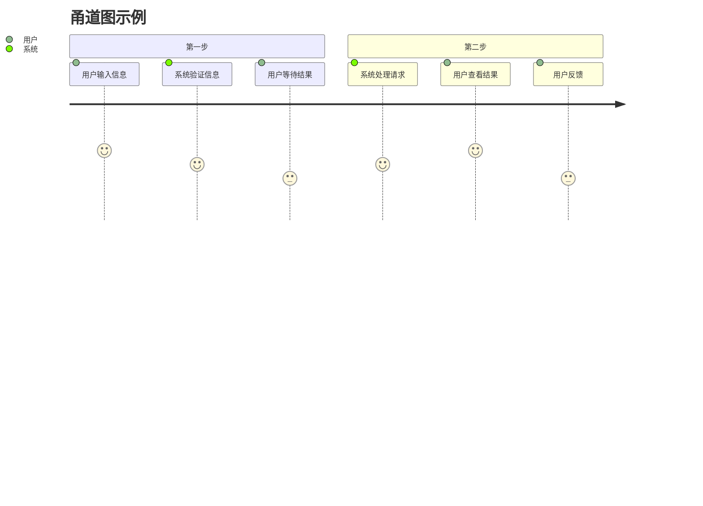
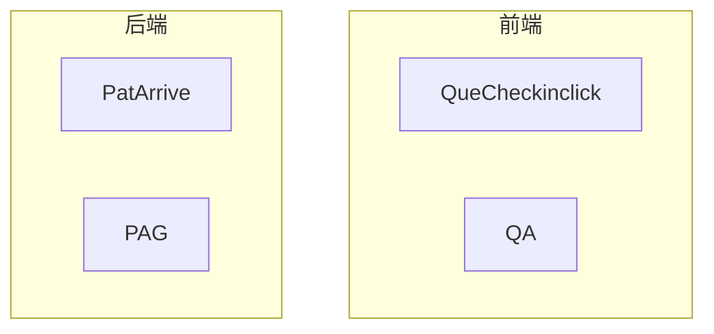
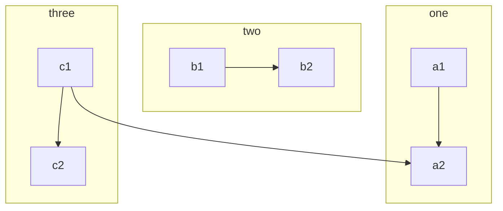

# Example



## 泳道图示例

```mermaid
%%{init: {'theme': 'base', 'themeVariables': { 'primaryColor': '#f9f9f9', 'primaryTextColor': '#333333', 'primaryBorderColor': '#cccccc'}}}%%
---
title: 泳道图示例
---

%% 定义泳道图
stateDiagram-v2
    [*] --> 开始
    state 开始 {
        [*] --> 执行
        执行 --> 结束
    }
    
    state "部门 A" as 部门A {
        [*] --> A任务1
        A任务1 --> A任务2
        A任务2 --> [*]
    }

    state "部门 B" as 部门B {
        [*] --> B任务1
        B任务1 --> B任务2
        B任务2 --> [*]
    }

    执行 --> 部门A
    部门A --> 部门B
    部门B --> 结束
```

## 甬道图示例



[process](https://drive.google.com/file/d/17-beBrLy1BqOIg2_pLHbhBZh34ZMsViU/view?usp=sharing)

## sub




