# 医生站生产安全规范总结

|**版本**|**作者**|**参与者**|**发布日期**|**修改摘要**|
| ---| --| --| --| --------------------------|
|**V1.**0|**谭吉善**||**2020-06-03**|**摘取自《东华医为生产安全管理规范（**V1.2**）》、《各期安全事件实用知识点汇总（每期更新）》，删减了部分与开发人员无关的内容。添加了**4.4.1Query**说明、**4.4.2**变量作用域说明**|
|**V1.1**|**郭荣勇**||**2020-06-05**|**添加了**4.4.3Routine**文件编译说明、**4.4.4**版本相关的类编译安全说明**|
|**V1.2**|**谭吉善**||**2020-06-09**|**添加了**2.1.5**中临时**global**、进程**global**的说明，添加了**Journal**的说明及应用**|
|**v1.3**|**谭吉善**||**2021-08-31**|**添加2.2.5.  使用对象的方式获取数据的注意事项**|
|**V1.4**|**谭吉善**||**2022-4-7**|**提交项目管理部发布的新操作规范**|

# 1.     生产安全管理**规范知识点摘要**

**该部分内容摘取自《东华医为生产安全管理规范（**V1.2**）》、《各期安全事件实用知识点汇总（每期更新）》，删减了部分与开发人员无关的内容。**

[附件1 第三方接口测试申请单.doc](assets/附件1 第三方接口测试申请单-20230428150828-3g0shyo.doc)

[附件2 生产库调试程序申请单.doc](assets/附件2 生产库调试程序申请单-20230428150828-dbap1kg.doc)

[附件3 代码更新说明测试用例.xlsx](assets/附件3 代码更新说明测试用例-20230428150829-nryx207.xlsx)

[附件4 生产库更新程序申请单.doc](assets/附件4 生产库更新程序申请单-20230428150829-efwuvcp.doc)

[附件5 项目程序更新日志.xlsx](assets/附件5 项目程序更新日志-20230428150829-88hu6nm.xlsx)

[项目生产系统更新操作规程20220406.pdf](assets/项目生产系统更新操作规程20220406-20230428150829-6t8i8fo.pdf)

‍

## 疑问

**1.规范类问题:**

**Q：附件3是否限定格式及规范，能否标注必填项，能否提交截图等内容;**

A:着重写更新说明，测试用例里可以针对调试结果、批量处理类测试用例、测试结果等方向，协助实施补充测试用例;

产品模块的升级或部署需求，测试用例是否可以直接使用产品说明书; 

**2.适用范围问题**

**Q：紧急bug类的问题，例如生产库无法挂号(包括微信支付宝等无测试环境问题)， 是否需要走审批申请流程;**

尚未上限、正在上线的项目是否需要走安全规范流程,如何界定项目阶段;

**3.建议**

**涉及前端功能调整的测试用例，建议直接在提需求阶段由实施补充至需求描述中。**

**开发人员需要对纯后台算法类需求补充测试用例，此类型需求大致为数据**

**结构调整或修复、后台程序执行异常、后台算法调整类的需求;**

## 1.1.    **医院生产系统更新操作规程**

### 1.1.1.  基本原则

* 请确认当前时间。除严重影响业务运行的BUG修复外，所有程序**严禁****在业务高峰期进行更新。**
* 请确认严格执行**<u>双人确认原则</u>**：即在进行程序更新或数据库操作时，必须首先确认所连接的数据库，在更新程序前要经过更新人本人之外的第二人确认后方可更新。
* 请确认严格执行**<u>单开单闭原则</u>**：即程序更新开始时，只允许打开正式库环境，不得同时打开正式库和测试库，更新完成后，应及时关闭与正式库的访问链接。
* **重要操作书面确认原则**：更新程序过程中如涉及到删除操作、数据更新操作、扩充表字段操作、编译公用方法或类等重要操作前，必须在更新日志中明确标记并告知项目经理。
* **核心操作上报规则**：针对数据库级别的修改，任何项目只有该项目的项目经理、或东华医为DBA有权限操作，其它任何人员不得操作；如果是项目经理操作，建议项目经理跟系统部沟通后再做修改。具体内容如下：

**1)   系统级参数修改操作：**如更改namespace、database、global mapping、routine mapping、package mapping、IIS增加虚拟目录等操作、任何系统级或应用级文件系统权限的修改，**必须**提前通知系统部人员，获得确认后方可执行；

**2)  应用系统级批量操作，**d $System.OBJ.DeletePackage("csp","dr")等，**必须**提前通知大区工程总监，获得确认后方可执行；

**3)** 更新过程中如涉及到删除操作、扩充表字段操作、编译公用方法或类等重要操作前，**必须**在更新日志中明确标记并提前告知项目经理。

* **专机更新规则：**对于上线后稳定期项目，项目现场需使用专用客户端进行程序更新或者系统级操作，专用客户端环境指定专人负责维护，原则上项目现场个人客户端不得进行程序更新或者系统级操作。使用专用客户端进行程序更新操作或者系统级操作时建议启用录屏功能，录制的视频文件至少保存一周方便后续跟踪查看。
* **实施工程师禁止开发财务交易需求：**针对涉及财务交易类业务需求，须提交到相应产品组，项目组成员不得擅自修改。

### 1.1.2.  **在测试环境进行程序测试**

#### 1.1.2.1.    **测试环境测试**

开发工程师和现场项目经理要对新程序可能影响的业务范围进行分析，以确定测试范围和测试方法，制订测试计划。

**开发工程师首先进行程序自测，然后再交由项目经理进行应用测试。**测试不仅要验证需求功能的实现，还要验证对相关业务没有造成影响。

按测试计划在测试环境进行测试，记录测试结果。如果测试出现问题务必修改后重新测试。现场项目经理有责任保持测试环境与生产系统的程序同步，以保证测试环境的有效性。

**<u>未经测试库测试的程序</u>**​**<u>严禁</u>****<u>在生产系统更新</u>**。否则一旦带来负面影响，必将重罚。

#### 1.1.2.2.    **无法提供测试环境的测试**

如果因第三方原因无法搭建测试环境的情况下，如果需要在正式环境进行程序调试、测试，开发人员书面申请，并需要获得项目经理、医院信息部门主管签字同意后方可进行，否则，所有责任由开发工程师完全承担。

### 1.1.3.  **备份原程序**

建立明确的程序备份目录，存放《项目程序更新日志》，按日期建子目录（必要时按功能再建一级子目录），将生产系统中需要备份的程序拷贝到相应子目录中。

要求开发人员将相应程序在个人工作电脑或设备中备份保存，并至少保留一周。

如果需要将生产库文件备份或导出至生产库临时文件夹下，那么在获得备份文件后，务必清除临时文件夹下的相关文件，以免占用磁盘空间。

### 1.1.4.  **进行程序更新**

在进行程序更新前请严格确认并执行以下规则：

在程序更新前向院方项目经理说明前期测试准备的结果，提出程序更新申请。 

除严重影响业务运行的BUG修复类程序更新，所有程序**<u>严禁</u>****<u>在业务高峰期进行程序更新</u>**​**，尽量避免在医院门诊工作时段内进行更新**，以免出现问题无法立即恢复给造成医院业务损失。另外也要注意程序更新后要留有一段时间进行运行观察，因此我们建议更新时间：

**a、**在正常工作日的中午午休时间更新，以便下午发现问题随时解决；

**b、**在正常工作日的晚上时间更新，项目经理及开发工程师第二天早上门诊开诊前到达医院。严禁开发工程师在晚间更新程序后，第二天一早离开项目现场。

在程序更新结束后，应及时关闭与正式库的连接窗口。在程序更新结束后需监测程序运行状况，项目经理或相关负责人在次日做日常安检时重点检查磁盘空间增长状况、journal是否异常、是否有开发性事物等。

### 1.1.5.  **关于**导出、删除、导入**Global**文件

* 备份导出Global时要核对具体的Global的数量。
* 部署产品组程序如需删除Global时，应与产品组逐一确认需要删除的Global，凡涉及删除Global的操作应明确具体的Global全名，不得以带“*”方式删除Global。
* 在往正式库上导入Global文件时，一定要评估文件的大小，查看生产库对应NameSpace空间是否足够满足导入文件的空间需求。
* 关于执行delete、update更新语句规定

**禁用**SqlDbx工具自动生成delete以及update语句

**禁用**sqldbx工具自动生成delete以及update语句：sqldbx工具生成delete语句如下图所示有两行，“Ctrl+Enter”快捷键是执行光标所在的当前行，若光标停留在delete这一行，就会误删除整张表，后果非常严重！！

​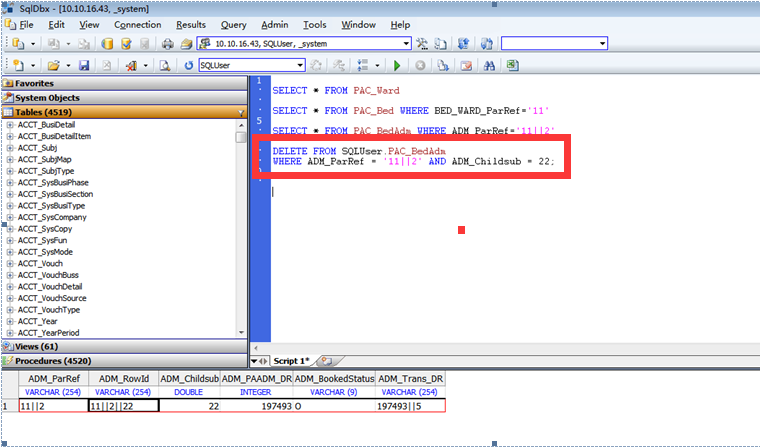​

正确的做法是：1、先用select语句带where条件将需要修改的数据查询定位出来，然后先把where条件写上，再写delete或者update后光标选中语句进行删除、更新。2、删除、更新操作上报项目经理，遵守“双人确认原则”。

### 1.1.6.   程序检测

程序更新后应按测试计划的范围进行相关程序的试用，以确认新程序满足了需求并且没有对其他程序造成影响。如果是开发工程师在现场进行程序的修改，要求开发工程师在现场进行半天至一天的监测，以便应对意外情况。

### 1.1.7.  **关于远程调试、更新程序**

开发工程师通过远程方式进行程序调试、更新的，项目现场必须安排一名实施人员对接，并监察整个调试、更新过程。通过远程方式，需要在正式库环境进行程序调试、更新的，**参照本规定1.1.1至1.1.4项对照执行**，特别强调，任何更新操作必须获得院方签字同意方可执行。关于远程更新的程序检测，**由对接的实施人员参考本规定1.1.3对照执行**。

远程更新程序后，开发工程师务必在当日及次日保持手机畅通，以便发生异常情况时能够及时联系沟通。

## 1.2.    **项目远程协助安全管理规定**

### 1.2.1.  **远程协助操作规程**

任何人员通过远程方式访问客户内网中系统（含生产环境、测试环境）进行操作的，需遵守如下操作规程：

1)、 **未经项目组成员确认，任何人员不得通过远程方式访问客户内网；**

2)、**在外网的人员需向项目组成员提交请求，要求进行内网访问；**

3)、项目组成员确认需要操作内容范围后，协助建立访问途径，并进行访问日志记录；

4)、连接结束后，项目组成员负责关闭访问途径。

## 1.3.    **Cach**é数据库密码及安全管理规定

### 1.3.1.  **数据库账户密码管理**

1)、 开发人员使用的账户密码由项目组管理发放，开发人员不得擅自记录、使用不属于自己权限内的账户密码。

2)、开发人员不得擅自对数据库级别的配置进行修改，不得擅自传播数据库账户密码。

### 1.3.2.  **数据库安全管理**

针对数据库级别的修改，任何项目只有该项目的项目经理、DBA有权限操作，其它任何人员不得操作，如需调整，需建议项目经理跟系统部沟通后再做修改。数据库级别的修改，包括：System Management Portal中所有的设置保存操作、数据库设置的系统参数修改（增加或删除database、namespace、Global mapping等）。

# 2.     各期安全事故知识点汇总

## 2.1.     **系统相关**

### 2.1.1.   **关于Global**的备份与删除

Global是存储在数据库不同的database下，映射到不同的命名空间下。如果通过DHC-APP命名空间查询Global并通过export方式导出备份时，不在这个命名空间下的Global导出的是空值（没有被成功备份）。当执行删除Global语句时，又会将这些Global的数据全部删除。

实例说明：通过Portal导出Global。下图一中DHC-APP命名空间Global 的默认数据库为DHC-DATA

​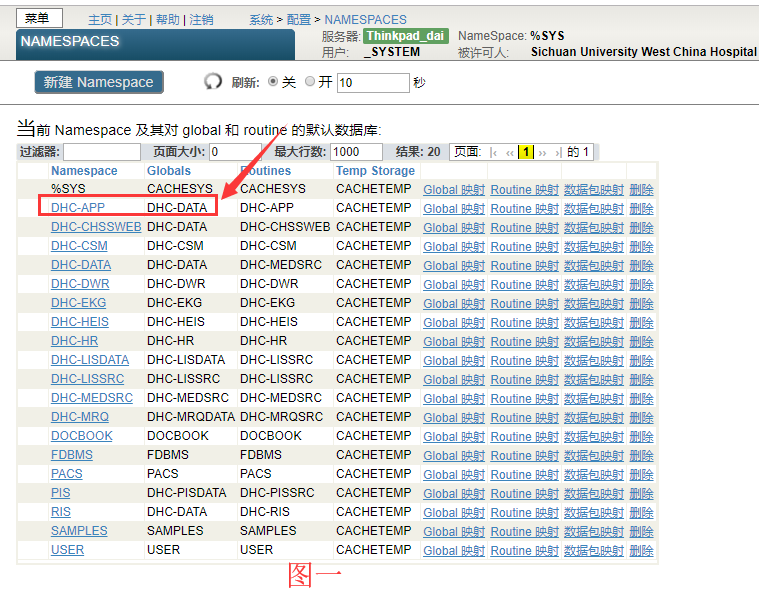​

下图二中Portal里面选择DHC-APP命名空间，查找DHCCA*会列出所有名字匹配的Global，如图所示共查找出34个Global，其中31个Global在DHC-DATA库，有三个Global不在DHC-DATA库，已经标红，导出完成以后会有日志显示，三个非DHC-DATA库的Global已跳过，表示导出的gof里面是不包括这三个Global数据。

---

​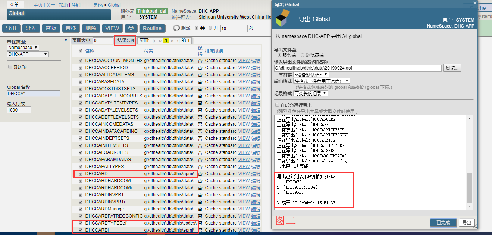​

通过命名空间查找并导出Global，只能导出命名空间Global默认数据库的相关Global，如果需要单独导出这三个Global的话。在Global导出界面查找范围选择database，然后选择相对应的库查找并导出，如下图三所示。

​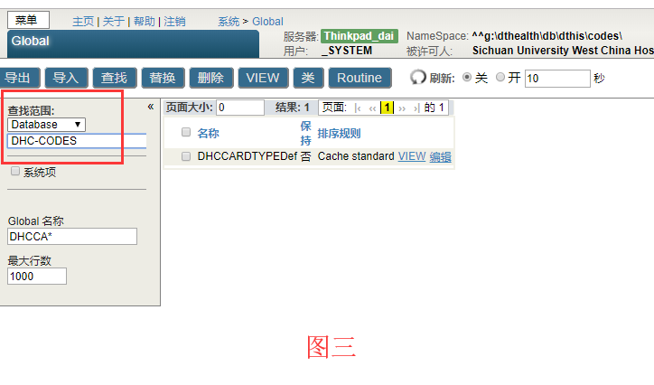​

**按照产品组部署文档进行删除global操作前需和产品组沟通确认，当执行删除Global时，建议按照全名逐个Global删除，不能用“DHCCA*”或者“*DHCCA*”等方式删除。**

---

### 2.1.2.   iMedical**系统CSP文件安全访问设置**

为了防止客户端通过浏览器直接访问CSP界面对应的URL链接，操作不当，导致意外发生。现通过以下两个方面的解决方法增强CSP访问的安全性。

**Ø  禁用IIS服务器dthealth虚拟目录浏览功能**

1)、查看、禁用dthealth虚拟目录浏览功能如下图所示：

​​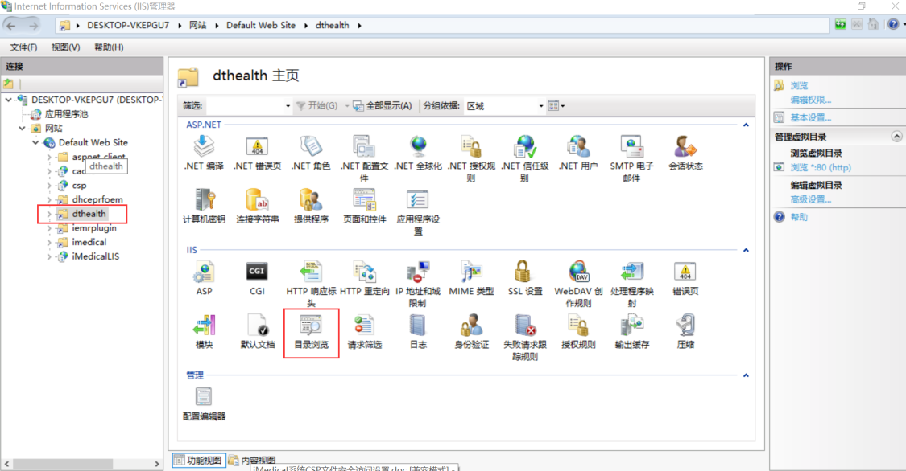​​

​​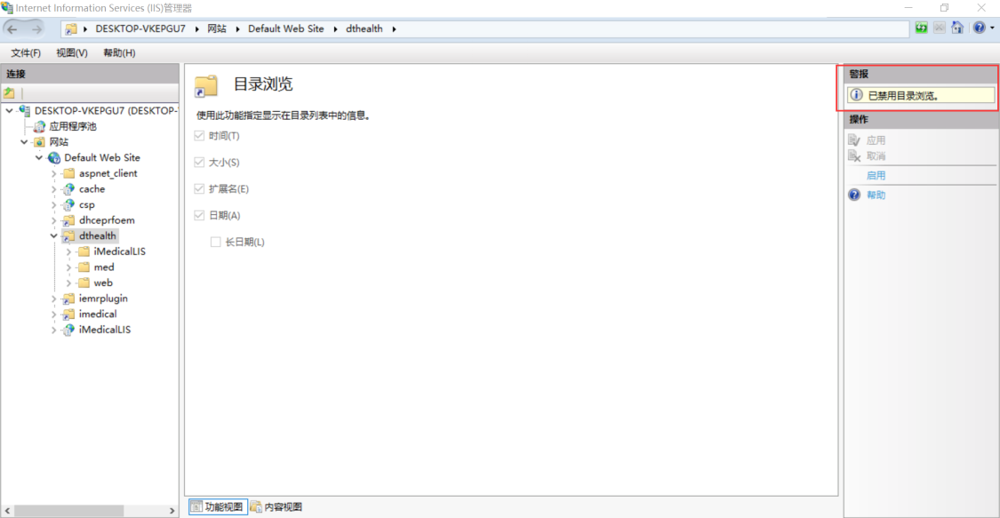​​

2)、更新方式

各项目组提需求到系统部，由相应系统部工程师做系统设置。

**Ø  修改相关CSP代码**

1)、对类似“初始化清理业务数据”、“导库存”等CSP高危代码进行修改,防止误操作调用。

在对应的CSP文件中增加websys.SessionEvents代码如下：

```
<csp:method name=OnPreHTTP arguments="" returntype=%Boolean>
 i ##Class(websys.SessionEvents).SessionExpired() q 1
</csp:method>
```

2)、更新方式

各项目组提需求到相应产品组，由相应的开发人员更新代码。

---

### 2.1.3.   Cache**数据库结束异常进程说明**

Q：halt退出和terminal右上角关闭有什么不同吗?

A：访问Windows服务器的terminal，敲”halt”和点terminal右上角”x”，效果是一样的，都是退出客户端与数据库及服务器的连接；

访问非Windows（Linux、AIX等）服务器的terminal，敲”halt”，只是断开客户端和数据库的连接，如果需要再断开与服务器连接，需要敲”exit”，点terminal右上角”x”，直接退出客户端与数据库及服务器的连接。

​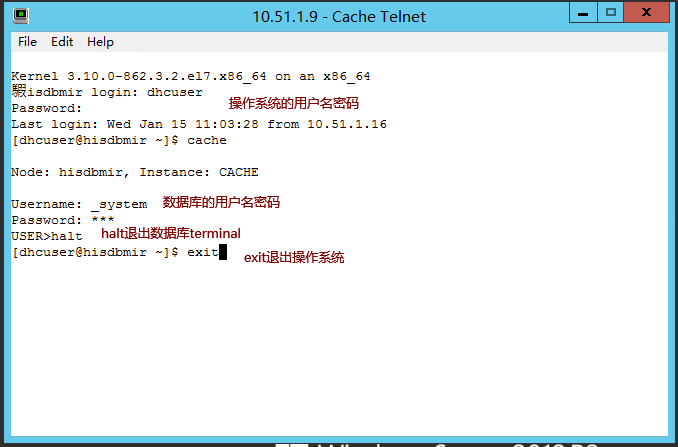​

Q：如果不小心写了死循环，process里把进程结束掉就可以么？

A：在terminal发现运行了有死循环的程序，查到对应进程，terminate杀掉有死循环进程即可；

​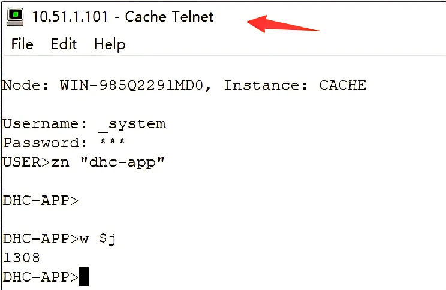​

输入”w $j”获得该终端对应在其他服务器中进程号（1308）

平时调试完程序后，尤其执行了类似Query等会在数据库后台跑的程序，关掉terminal之前，”w $j”查一下pid，在portal找到进程，terminal关掉后，看portal中进程是否自动结束，如果长时间没有结束（和预估时间差别较大），可能有死循环问题。

### 2.1.4.   数据库版本对编译结果的影响

1)、被cache2016、Ensemble2016编译过的cls，在低版本的数据库上都将无法使用；

2)、在跨数据库版本做ECP映射的场景下，高版本数据库上只能是通过Namespace获取Global数据，严禁做编译操作。

### 2.1.5.  **临时**Global**的使用方式及注意事项**

#### 2.1.5.1.    **临时**Global**的命名**

命名规范为^TEMP*、^Temp、^temp*、^TMP、^Tmp*、^tmptmp、^CacheTemp**，注意大小写，不允许有其它的命名。 注意大小写，不允许有其它的命名。

其中^^^TEMP*、^TempTemp、*​^^^​*temp、*​^^^​*TMP、*​^^^​*Tmp*、*​^^^​*tmptmp存储在DHC-TEMP库文件中，该文件为东华医为iMedical系统的临时库。CacheTemp存储在CACHETEMP库文件中。*

#### 2.1.5.2.    **临时**Global**的特性**

* CACHETEMP、DHC-TEMP库文件定性为临时库，项目组定期评估该文件是否需要被删除或替换（数据库级别的修改操作需上报系统部处理），故不能存储持久性数据。
* CACHETEMP、DHC-TEMP库文件系统被设定为不做Journa记录，数据无法被回滚。
* CACHETEMP、DHC-TEMP库文件由于是人员定期操作删除或替换，程序生成临时global，处理完业务逻辑后，一定要在程序中kill 掉临时global。否则会造成DHC-TEMP库文件日益增大，占用大量磁盘空间，最终影响医院生产业务系统正常使用

#### 2.1.5.3.    **进程**Global**的特性**

进程Global的书写形式为^||，他能创建一个本进程专属的全局私有变量，所有命名空间均可访问该数据，但不会存储到任何库文件中，也不会产生Journal，事务回滚也不会对该数据造成影响，应用效果类似数组，但是不受ProcedureBlock、New命令的影响，是一个**全局**私有变量。

更多内容请参考SMP:

[Process-private Globals](http://127.0.0.1/csp/docbook/DocBook.UI.Page.cls?KEY=GCOS_variables#GCOS_variables_procprivglbls)

### 2.1.6.   Journal**的应用**

Journal是数据库的一套数据操作日志记录系统，与备份库结合使用，能使数据库恢复至故障前的状态。

DHC-TEMP[、]()TEMP 临时库文件的 journal 属性需要设置为 No，避免在 set、kill 临时global产生过多[ ]() journal 文件，导致磁盘增长过快。具体设置路径如下图：

​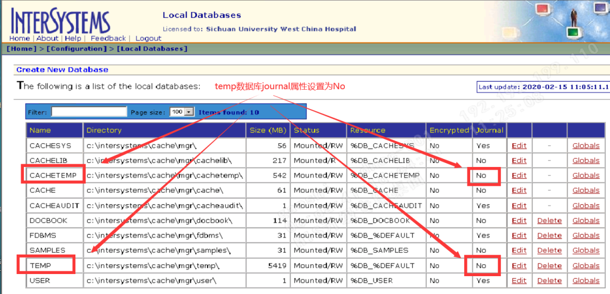​

事务的运行原理本质上是根据事务开启至事务结束时的journal日志进行的数据处理。具体参考一下示例理解Journal的运行机制。

#### 2.1.6.1.    **示例**1

**l**​***^^*** **在terminal中运行一段命令**

​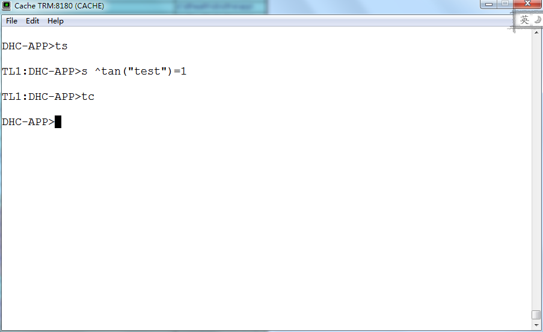​

**l**​***^^*** **观察Journal中的日志记录**

​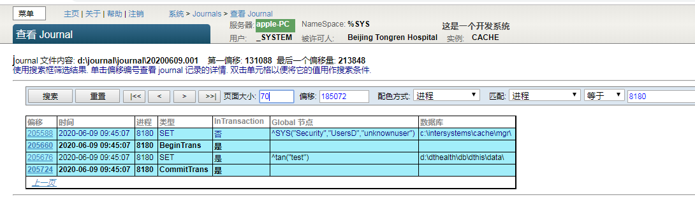​

偏移：该笔记录在Journal中的流水号

时间：操作发生的时间

进程：该操作所在的进程号

类型：如题

InTransaction：是否在事务中

Global节点：该笔记录操作的Global节点

数据库:该Global所在的数据库文件

**l**​***^^*** **总结**

当执行TS命令时，数据库进行了事务开始记录，并记录了后续该进程操作的Global数据，当事务结束时，置事务结束标志。

#### 2.1.6.2.    **示例**2

**l**​***^^*** **在Terminal中运行一段命令**

​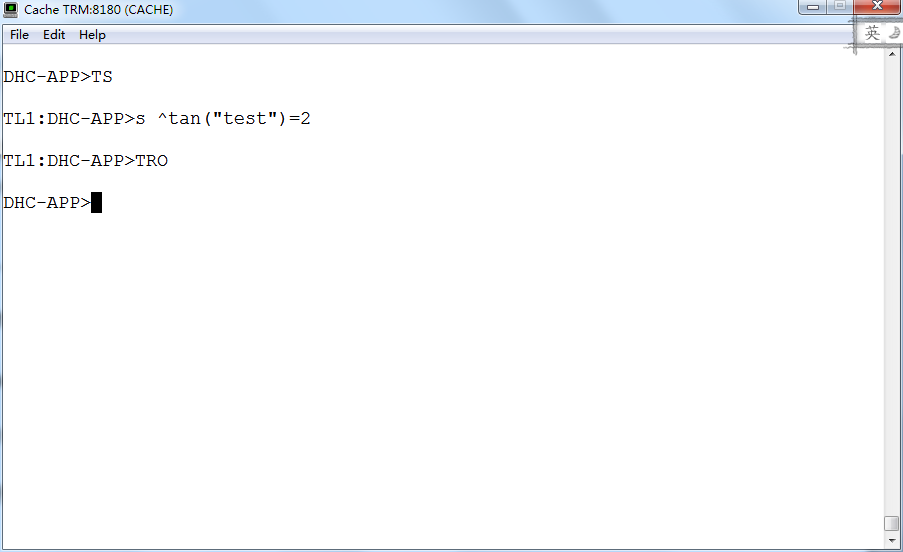​

**l**​***^^*** **观察Journal中的日志记录**

​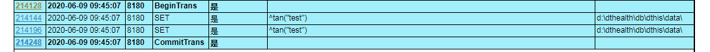​

**l**​***^^***  **点击偏移量214144，并观察内容**

​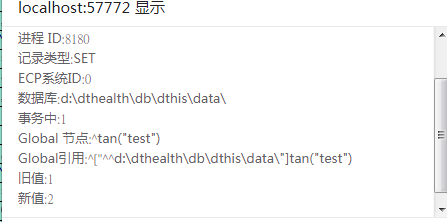​

**l**​***^^***  **点击偏移量214196，并观察内容**

​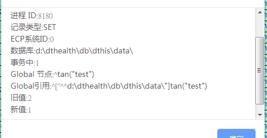​

**l**​***^^*** **总结**

事务的回滚实际是根据Journal中记录的事务开启到结束过程中对Global的操作，并进行还原。事务的回滚也仅对开启了Journal日志功能的数据库生效，对临时Global无法生效。

需要注意的是，对Global的操作顺序是先进行了赋值写入，后根据Journal进行还原赋值。

## 2.2.     程序相关

### 2.2.1.   编写、执行Query**以及查询程序书写、测试、运行过程注意事项**

**Query以及查询程序书写注意事项（参照《Cache'代码编写规范》）：**

对于临时Global，应严格按照临时Global的命名规范进行命名。

程序生成临时global，处理完业务逻辑后，一定要在程序中kill 掉临时global。

---

**测试环境测试注意事项：**

1）、遵守东华医为关于“生产库更新操作规程”，先在测试库测试、调试Query以及查询程序。

2）、若程序入参包含开始日期、结束日期，在测试库上设定时间段为一天，再到一个月逐步测试和调试，方便分段、调试程序查找问题。

3）、**​ ​**Query以及查询程序正常结束时，临时global才能被Kill掉。若因为程序死循环，数据不断写入，就会造成DHC-TEMP 库文件日益增大，占用磁盘空间，最终影响医院生产业务系统正常使用。因此测试库调试程序时需重点检查程序代码中循环变量定义是否唯一，循环的变量和global的索引关键字是否匹配，循环能否正常退出等容易造成程序死循环的情况。

---

**循环的变量和global的索引关键字不匹配情况：**

以下两部分程序左边是错误的

​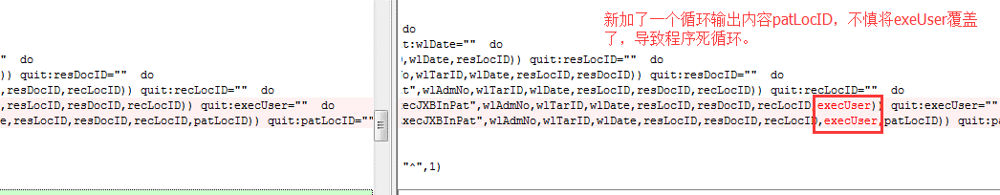​

**程序代码中循环变量定义是否唯一，例如：**

**以下是正确的：**

​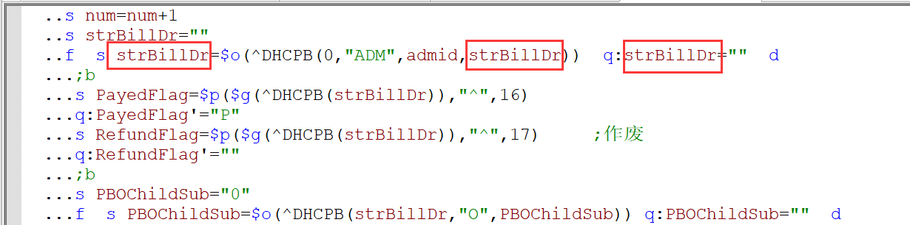​

**以下是错误的：**

​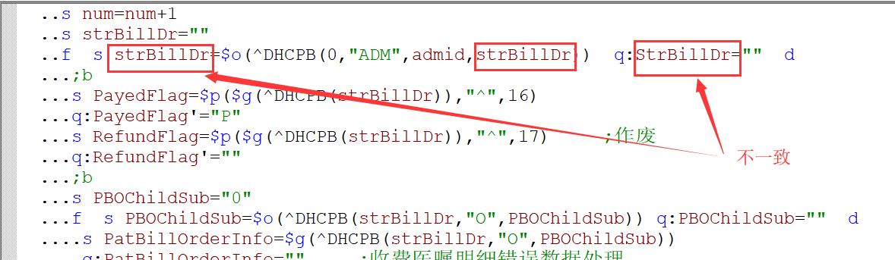​

Ø  **正式库环境执行程序时注意事项：**

1）、正式库执行程序时，根据医院的业务量，设置开始日期到结束日期的时间段为半年或者一年，原则上不得超过一年。

2）、正式库上程序执行过程中注意监测程序运行状况，重点监测磁盘空间增长、磁盘占用率，锁表、日志异常增长、是否有开发性事物等情况，认真做好日常安检。

3）、根据经验，一般业务查询query运行10s内就应该结束。如果超过时间，应结束程序进程，并排查代码。若因查询内容过大导致的query查询效率低下，应考虑该内容是否应由综合查询组处理。

#### 2.2.1.1.    **%Query**四个方法的功能说明

Query：用于定义一个%Query类型的方法，用作查询时调用。

Excute：查询主体，根据Query方法的入参执行查询动作，获取最终需要输出的数据集，存储在^CacheTemp中。qHandle在该方法中被初始化，用于在Fetch、Close方法之间做唯一值标识传递。

Fetch：提取数据集，每次获取一条数据。该方法通过修改qHandle的值，来实现如何退出执行Query。

Close：关闭Query，清除用户临时存储在^CacheTemp中的数据。

#### 2.2.1.2.    **%Query**与**websys.Query**的使用区别

%Query：使用时，Query、Excute、Fetch、Close四个方法必须都要声明并实现。

websys.Query：对于绝大部分书写的Query程序，Fetch、Close的内容都是一致的，对于声明为该类型的Query，在编译时可自动生成对应的Fetch、Close代码，因此仅需要声明两个方法即可。

### 2.2.2.   变量作用域与关键字ProcedureBlock**、**New之间的关系

#### 2.2.2.1.    **ProcedureBlock**

ProcedureBlock用于指定方法中的变量是否属于块级作用域。该关键字也可针对某个独立方法使用。以下是两种ProcedureBlock的声明方式。

```
Class web.DHCDocOrderCommon Extends %RegisteredObject [ ClassType = "", Not ProcedureBlock ]
```

或

```
ClassMethod GetItemCongeriesToListTest() As %String [ ProcedureBlock = 0 ]
{
略
}
```

当ProcedureBlock为True时，变量作用域为块级，仅在当前方法中有效；当ProcedureBlock为false时，变量上升为当前进程的全局变量，任何在该进程中运行的方法均可对该变量进行访问或修改。

**注意：**

1)、当内存的调用链中既有ProcedureBlock=True，也有ProcedureBlock=false的情况，所有ProcedureBlock=True的方法内变量均有独立的作用域，互不影响。但ProcedureBlock=false的方法会共享一个作用域，内部变量有可能会互相影响。

2)、所有的代码段均没有独立的作用域。

#### 2.2.2.2.    **New**

New命令可以为本方法和本方法的调用链方法创建新的变量作用域。该命令在方法、代码段中均可使用。

**注意：**

1)、New是在命令执行时开辟的新变量作用域，该命令之后的变量或调用的子方法共享该变量作用域。

2)、若调用子方法链中存在既有ProcedureBlock=True，也有ProcedureBlock=false的情况，所有ProcedureBlock=True的方法内变量均有独立的作用域，互不影响。但ProcedureBlock=false的方法会共享之前New开辟的新变量作用域，内部变量有可能会互相影响。

### 2.2.3.   Medsrc**下routine文件的编译**

#### ***^^***2.2.3.1.   **编译所产生的文件说明**

mac后缀名文件为面向过程的M编码文件格式；编译后的文件后缀为int（int为mac或者class编译后的文件，生成的int有大小限定，所以对于比较大的class会产生多个int文件，在文件名后加上文件计数；mac文件只会产生一个int，所以太大的mac文件编译会报<STORE>的错误）。

例如：

DHCDocOrderCommon.mac编译后产生DHCDocOrderCommon.int,

web.DHCOPAdmReg.cls编译后产生的【例程】,编译类时在即时窗口可见：

web.DHCOPAdmReg.1.int；web.DHCOPAdmReg.2.int

---

int后缀名文件编译后则生成机器码文件，后缀名为obj，此类文件无法编辑，仅可导出导入（往往用于还原某个时间点的机器码文件）

#### 2.2.3.2.   **对于**mac**中有**sql**语句**

**如果mac在dhc-app/websrc/websource*****^^***​ ​**命名空间下，则能直接编译通过；**

**如果mac在dhc-medsrc/medsrc/medsource命名空间下，则不能直接编译通过，需要使用Terminal在dhc-data/meddata命名空间下通过d ^%urcomp命令编译通过**

​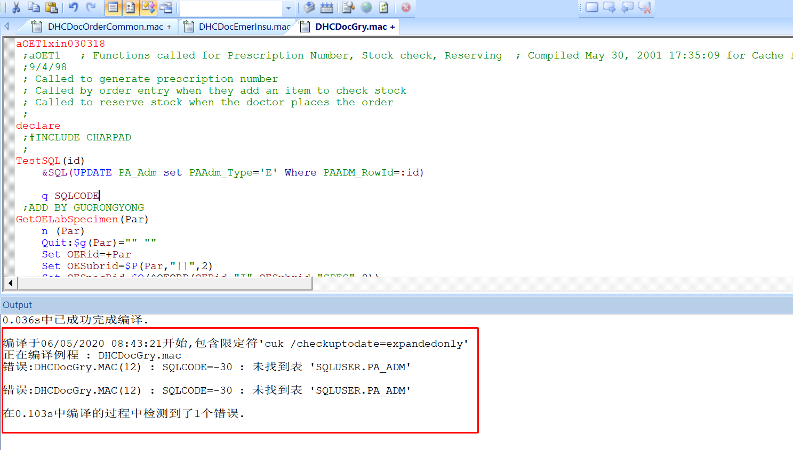​

图一[ ]()mac中存在sql报错

​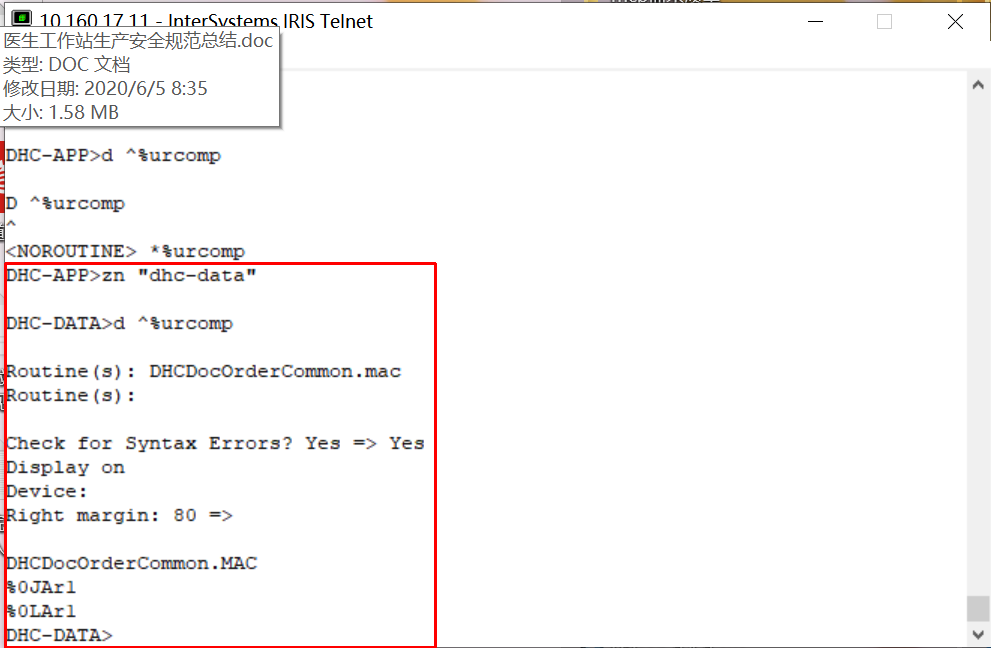​

图二[ ]() 在dhc-data下编译成功

**【如果不编译成功，则将直接导致所有涉及sql语句的函数都执行不成功，没有sql语句的函数可以正常执行。】**

**大家思考一下为什么编译会是这样的情况？**

---

### 2.2.4.  ​**版本说明及与版本相关的类编译安全**

**V8.3版本及以上版本，不再使用dhc-medsrc下的routine程序**

**V8.3版本之前的版本**

**（1）cache2010之前的版本不能编译web包根目录下非DHC开头的类，不直接编译整个工程**

**（2）cache2010及以上的数据库版本，可以编译所有业务类**

---

### 2.2.5.  使用对象的方式获取数据的注意事项

```
/// w ##Class(web.tanjishan).test(100)
ClassMethod test(RegfeeRowId)
{
	s AdmDr=""
	s obj=##class(User.DHCQueue).%OpenId(ID)
	if $IsObject(obj){
		s AdmDr=obj.QuePaadmDr.%Id()
		d obj.%Close()
	}
	q AdmDr
}
```

#### 2.2.5.1避免在循环中使用对象的方式获取数据  ，尤其是在事务中的循环，可能会造成大量锁表

打开CacheStorage结构的表时不加锁，打开CacheSQLStorage的表时会加锁 ，这些锁属于普通的共享锁，受事务影响；

示例一：对PA_Adm表使用open或者对DHCQueue表使用obj.QuePaadmDr.%Id()都会对PA_Adm进行加锁 

示例二：在事务中循环打开PA_Adm的引用，会导致大批量的PAADM无法解锁。

​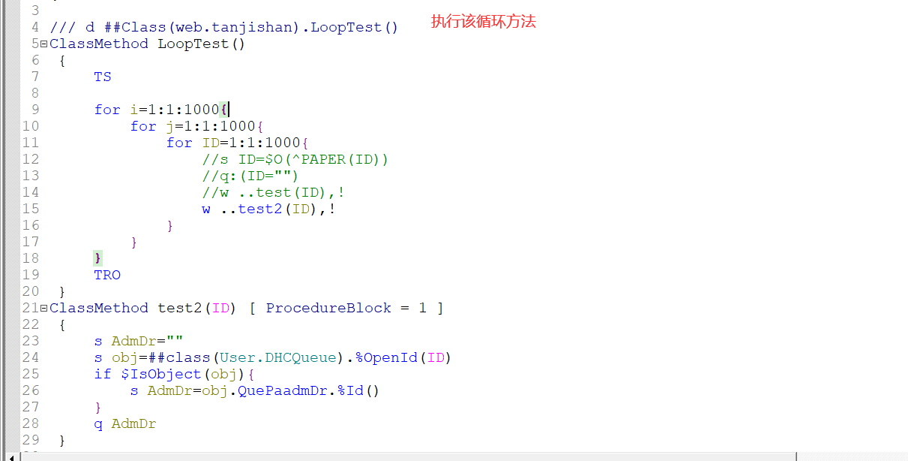​

​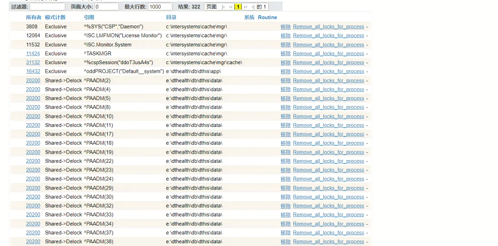​

#### 2.2.5.2 %Close()在Caché version 5.0版本之后弃用，系统会根据对象的引用位置自动释放OREFs

**【**​[http://localhost:57772/csp/docbook/DocBook.UI.Page.cls?KEY=RCOS_ckill#RCOS_ckill45](http://localhost:57772/csp/docbook/DocBook.UI.Page.cls?KEY=RCOS_ckill#RCOS_ckill45)】

## 2.3.     需求相关

### 2.3.1.   后台删除或修改医嘱信息、患者病历信息、患者基本信息等需求合理判断

**患者电子病历相关信息作为法律医疗事故技术鉴定的主要依据，不能随意更改。项目经理对院方提出的需求应判断合理性，因用户未按规范操作，导致需要后台删除或修改医嘱信息、患者病历信息、患者基本信息的需求项目经理有权拒绝，或者要求医院以书面形式提交需求。**

‍
