# 1 模块依赖关系
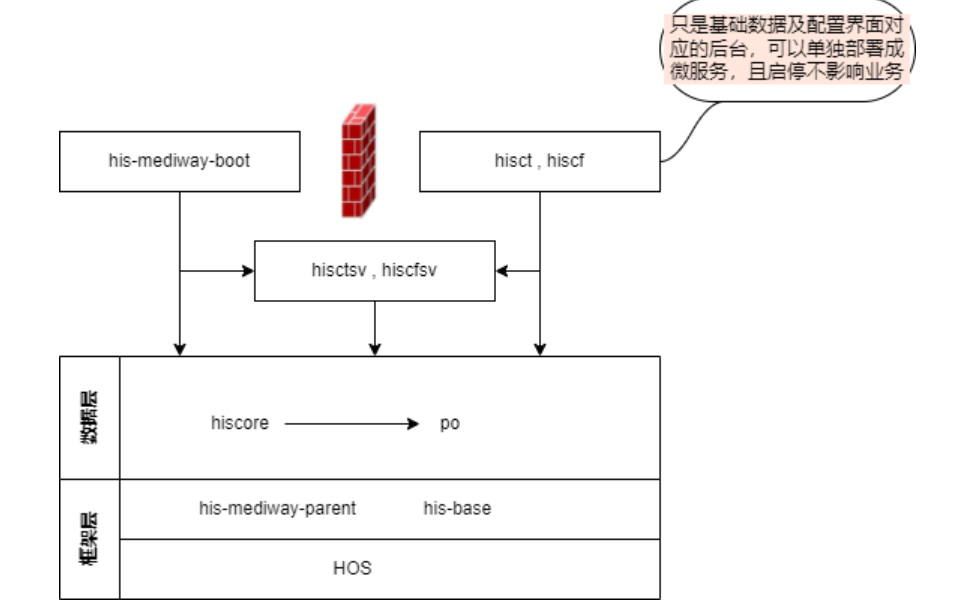

# 2 HOS基础开发平台【最外层框架】
http://114.242.246.250:8034/home/

# 3 创建表注意事项
不要用DBeaver 生成的DDL复制修改后生成表
因为生成的表id不能自增，建议用相关表结构里的DDL生成

# 4 信创版主要通用配置
## 4.1 通用字典
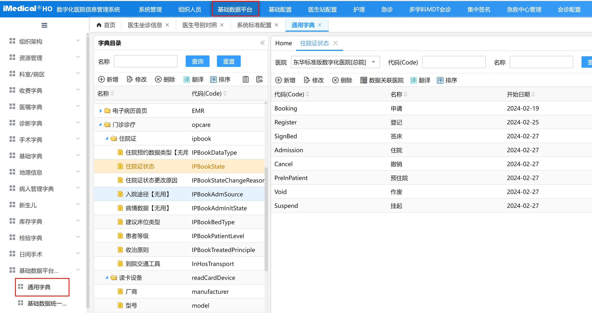
```
com.mediway.his.ctsv.dic.service.CtDicCommondictService#getSelectList
com.mediway.his.ctsv.dic.service.CtDicCommondictService#getComboList
```

## 4.2 系统标准配置
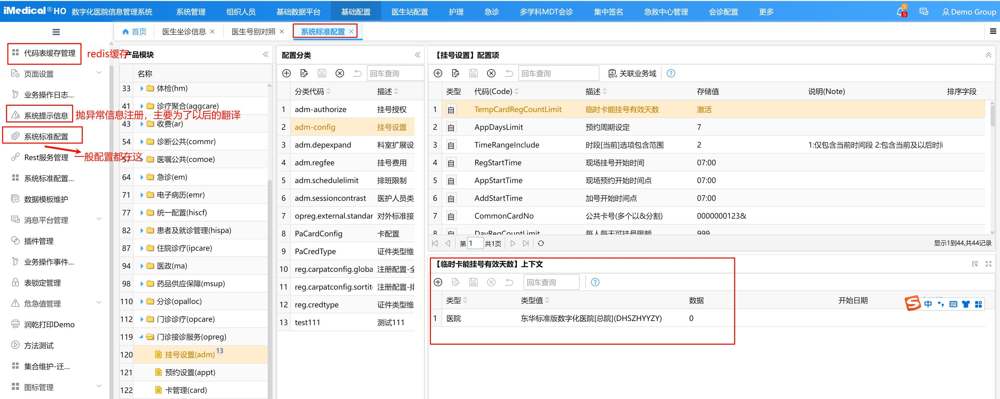
医生站只简单封装了一下，大多数还得直接调汪工的com.mediway.his.hiscfsv.bsp.util.HisConfigUtils类  
还有自定义上下文等
```
医生站封装
@Resource(name = "hiscfsv.ipcare.doctor.busGeneralConfigBLH")  
private BusGeneralConfigBLH busGeneralConfigBLH;

BusGeneralConfigDTO busGeneralConfigDTO = new BusGeneralConfigDTO()  
        .setModuleCode("ihd.opreg").setConfigCode("PreserveRegNo");  
boolean preserveRegNoFlag = busGeneralConfigBLH.getParamBoolean(busGeneralConfigDTO);
```
[基础配置-系统标准配置](../其他组资料/基础平台/基础配置-系统标准配置.md)

## 4.3 系统提示信息
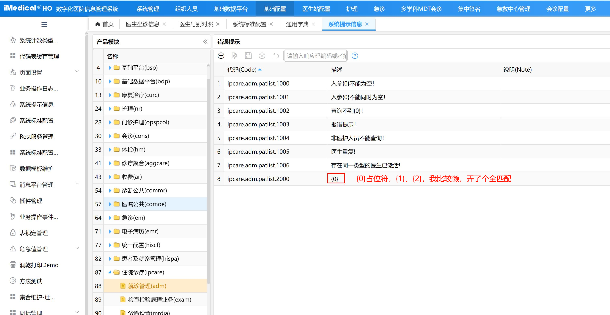

# 5 Redis缓存【推荐使用】
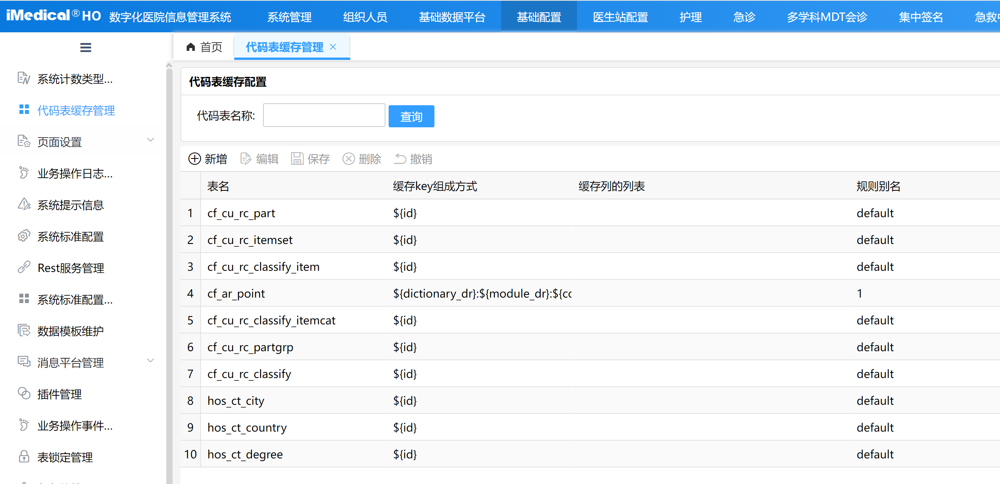
https://106.63.4.7:8000/his-mediway-java/his-document/-/blob/master/rule/cache/readme.md  
由于从java后端调用数据库，比较耗时，对于字典表、配置表，基础平台崔兴阳提供了redis缓存调用的方式
注：由于redis服务器在远端，个人早期测试，效果比较差，比查询数据库还差，在项目上可能会好

- 医生站对redis调用接口进行了封装  
在com.mediway.his.hisbase.doc.utils.DocCacheUtils类中
- 梁路丰批量获取缓存优化
[!redis缓存批量获取优化-梁路丰](../Redis/!redis缓存批量获取优化-梁路丰.md)

## 5.1 查看redis缓存数据
- 软件：Redis-Insight
### 5.1.1 登录
84
81.70.230.87:8094
DHCC#2023@1016

87
81.70.230.87:6379
DHCC#2023@1016

# 6 业务代码简介
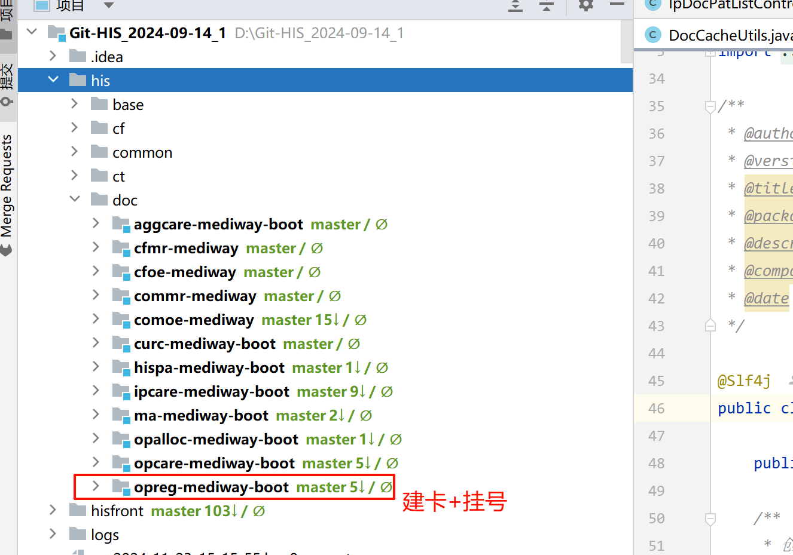
boot模块要作为微服务启动，其他模块只能通过feign接口调用

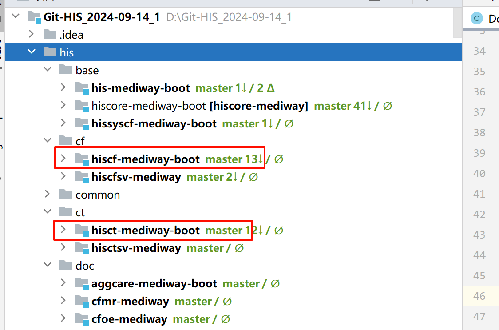
hiscf-mediway-boot、hisct-mediway-boot是配置或字典界面【东华说法叫领域和……（没记住）】的后端代码  
hiscfsv-mediway、hisctsv-mediway是提供其他模块调用，可直接调用  
hiscore-mediway 是最基本模块【表数据查询】，不能调用其他模块

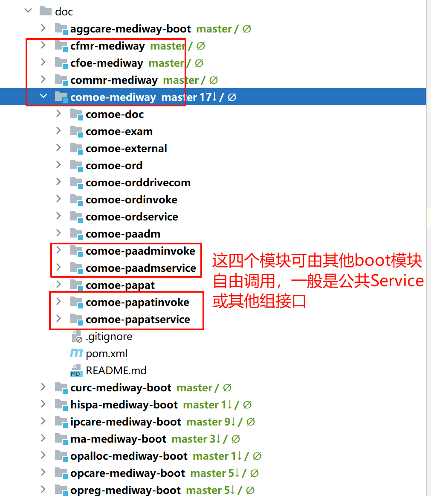
commr-mediway  
comoe-mediway  
主要是诊断医嘱的公共代码，因为拆分op、ip集中到这些模块

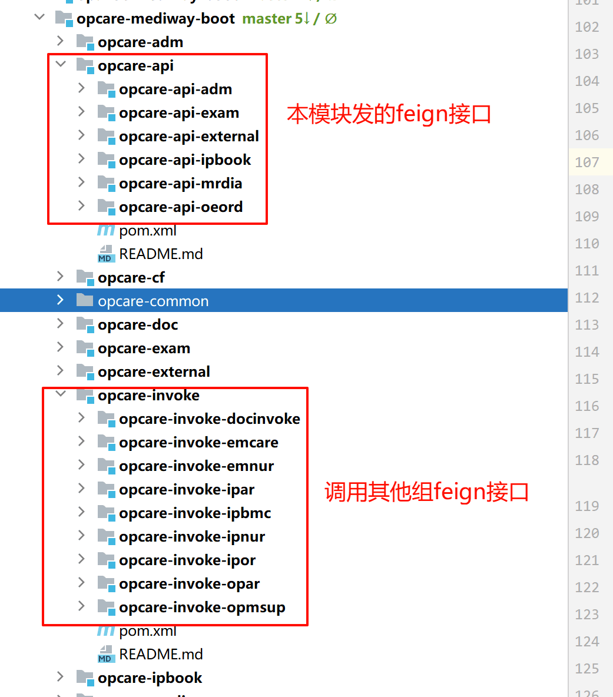

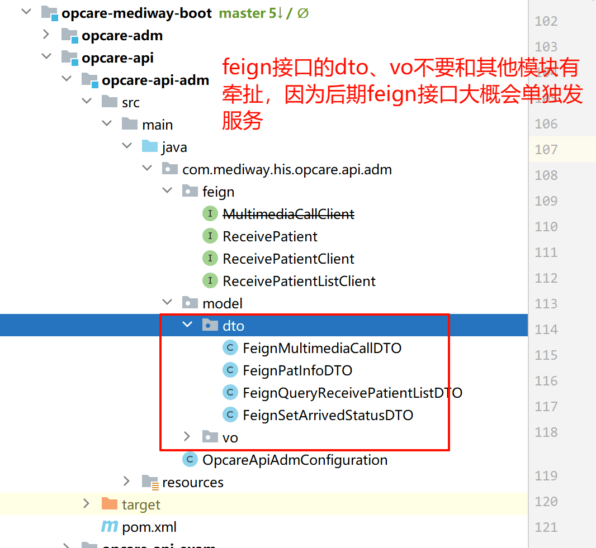

# 7 Lodop打印
## 7.1 hos组提供接口
http://114.242.246.250:8034/home/developmentStage/backendManual/lodop.html#%E6%A6%82%E8%BF%B0
`websys_getTop()` 替换 `window.parent` 可解决弹窗界面打印问题
```
let params = {
	code: "Hospital_Admission_Certificate",
	param: JSON.stringify(rtnObj.data)
};
// 打印
websys_getTop().postMessage({
	funcName: 'printFn',
	lodopName: websys_getTop().name,
	params: params
}, '*');
```

## 7.2 客户端环境
http://www.c-lodop.com/download.html

# 8 开发规范
## 8.1 医生站代码规范
http://medicaldoc.i234.me:21003/
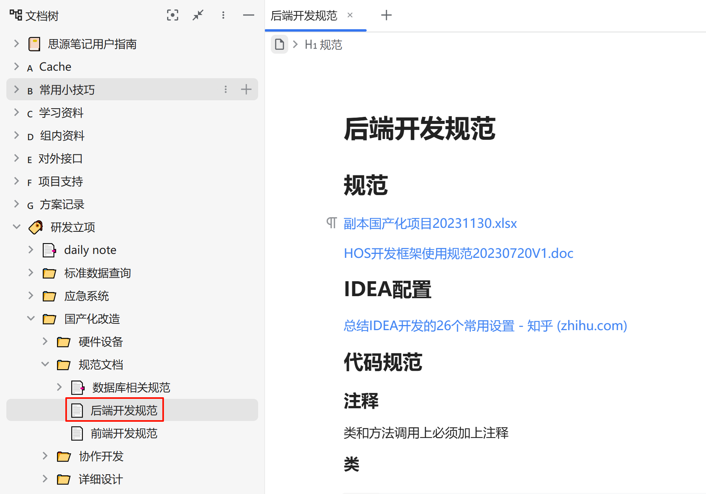

## 8.2 其他规范
https://106.63.4.7:8000/his-mediway-java/his-document/-/blob/master/rule/develope-rule.md

第三方工具包建议hutool为主 
https://www.hutool.cn/

https://blog.csdn.net/weixin_40797576/article/details/103425623  
在入参dto中限制不为空 
个人不喜欢用

https://blog.csdn.net/dong__CSDN/article/details/119037599
Kingbase锁表后解锁操作

## 8.3 常用框架
### 8.3.1 hisui框架-汪会财
- `<script type="text/javascript" src="../../../base/scripts/hisui.js"></script>`

### 8.3.2 院区下拉框-汪会财
- `<script type="text/javascript" src="../../../base/scripts/hisui/websys.comm.js"></script>`

### 8.3.3 医为插件【读卡插件等引用】-汪会财
- `<addins></addins>`

### 8.3.4 外部接口中间层-李旭
- `<script type="text/javascript" src="../../../base/scripts/doc/util/doc.interface.js" product="Card,CardReg" medStepCode="CardReg"></script>`
product【业务中间层 详见外部接口接入管理】
medStepCode 诊疗环节【读卡用】

### 8.3.5 医生站按钮框架-王清雍
```
<script type="text/javascript" src="../../../base/scripts/doc/plugins/mary-btnbar/marybtnbar.js"></script>
<link rel="stylesheet" type="text/css" href="../../../base/scripts/doc/plugins/mary-btnbar/marybtnbar.css">
```

### 8.3.6 csp-if框架-李旭
- `<script type="text/javascript" src="../../../base/scripts/doc/util/custom.elements.js" defer></script>`
其中标签需要成对存在
主要标签 
```
if-else判断
<csp-if condition='条件' template="xxx">
	<template id="xxx">
		<布局一>
	</template>
</csp-if>
<csp-else template="yyy">
	<template id="yyy">
		<布局二>
	</template>
</csp-else>

如果是多个if条件，应该并列
<csp-if condition='条件' template="xxx">
	……
</csp-if>
<csp-if condition='条件' template="xxx">
	……
</csp-if>

可如iris直接引入html
<csp-include Page="patorderview.show.html"></csp-include>
```

参考代码 ipcare/oeord/html/patinfoview.html
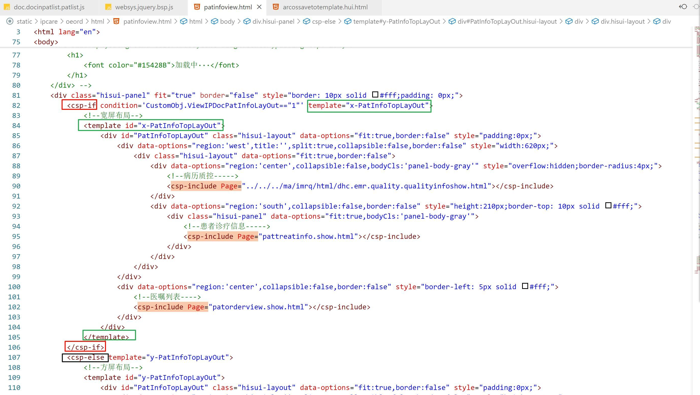

### 8.3.7 获取url入参
```
<script type="text/javascript" src="../../../base/scripts/doc/util/doc.url.js"></script>
getURLParams
getURLParamsObj
```

### 8.3.8 前端分页
```
<script type="text/javascript" src="../../../base/scripts/doc/util/tools.hui.js"></script>

loadFilter: DocToolsHUI.lib.pagerFilter,
$('#dg').datagrid({ loadFilter: DocToolsHUI.lib.pagerFilter });
```
- ! 注：
采用前端分页，后端要么直接返回`List<Object>`，要么在返回对象中rows

返回rows时必须有total属性
```
@ApiModelProperty(value = "就诊信息列表")  
private List<IpDocInPatDataVO> rows;  
  
@ApiModelProperty(value = "总计", notes = "datagrid如果返回rows,则total必返回用于前端分页")  
private Integer total;
```

# 9 SQL注意事项
DATE() 转日期，目前只有Kingbase数据库能用，不要使用
建议使用to_char()、to_date()

# 10 调试程序
## 10.1 前端业务页面调用

## 10.2 postman等API 测试工具
- ! 需要Access-Token

## 10.3 API 测试插件
- ! 需要Access-Token

### 10.3.1 VSCode
- REST Client
- 使用http文件执行，调用后台接口
发送 HTTP 请求并直接在 VSCode 中查看响应
模拟前台请求，功能类似postman

### 10.3.2 IDEA
- 使用http文件执行，调用后台接口
参考代码
```
his/doc/hispa-mediway-boot/hispa-pat/src/test/http/查询患者过敏信息.http  
```
- Apifox 等插件
可以生成Json串，并模拟前台请求

# 11 弹窗路径问题
- ! 不要使用自己组织的绝对路径，如"/his/hispa/pat/html/doc.cardtypelist.html"
- ! 因为his这一层路径，是可以由项目修改

## 11.1 模态框
url：相对于base目录
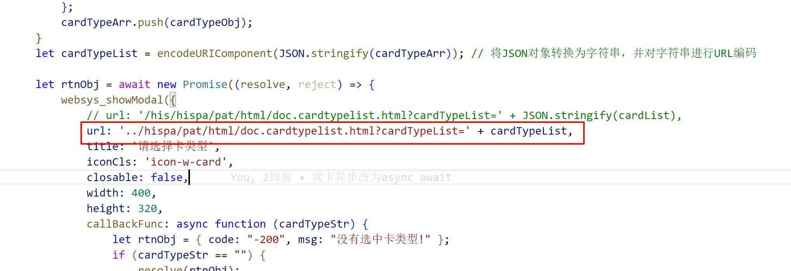
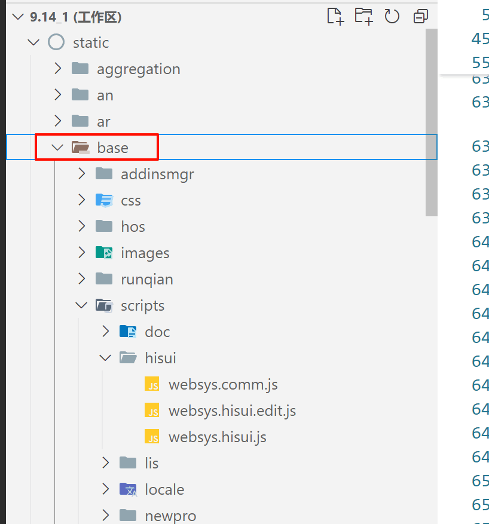

## 11.2 普通弹窗
url：相对于当前页面

## 11.3 动态获取当前js路径
```
var tmpscripts = document.getElementsByTagName('script');  
var currentScript = tmpscripts[tmpscripts.length - 1];  
let currentSrc = currentScript.getAttribute('src');  
// 地址前缀  
let basePath = currentSrc.slice(0, currentSrc.indexOf('/hispa/'));  
url = basePath + url;
```

## 11.4 获取当前url的根路径
```
var URL = "../bsp/criticalvalue/html/trans.html?id="+ReportId;  
//传入相对base的路径 获得根路径  适配在不同场景下打开  
URL = websys_frontPathCombine(URL);
```

# 12 第三方接口管理
http://114.242.246.250:8034/home/developmentStage/backendManual/interface.html#_1-%E6%A6%82%E8%BF%B0
参考代码：
com.mediway.his.comoe.ordinvoke.blh.hrp.imedical.HRPStockComInvokeAbstract#getMaterialStock
```
ObjectMapper mapper = new ObjectMapper();
String body = mapper.writeValueAsString(dto);
String result = InterfaceUtil.executeRestByBody(interfaceCode, body);  
BaseResponse<List<GetMaterialStockVO>> baseResponse = mapper.readValue(result, BaseResponse.class);  
return baseResponse.getData();
```

# 13 业务相关
## 13.1 建卡挂号-邢凯乐
https://www.yuque.com/skylercook/working/wu89ua0c5ho3ztwo?singleDoc#

## 13.2 处方流转-邢凯乐
https://www.yuque.com/skylercook/working/zl0gp4e5pbbqx6gq?singleDoc#

# 14 工具类推荐
## 14.1 列表(集合)转Map
com.mediway.his.hisbase.doc.utils.DocStreamUtil#toMap

## 14.2 对象拷贝
- 单层
org.springframework.beans.BeanUtils#copyProperties【不支持嵌套对象】
cn.hutool.core.bean.BeanUtil#copyProperties 
- 列表拷贝
com.mediway.his.hisbase.utils.ConvertBeanUtil#convertBeans2Beans【速度最快、不支持嵌套对象】
cn.hutool.core.bean.BeanUtil#copyToList

## 14.3 json转换
com.mediway.his.hisbase.utils.JsonUtils

// json字符串转List
JsonUtils.parseJson() 
// json字符串转对象
JsonUtils.parseJsonToObject
// 对象转json字符串
JsonUtils.toJson();

还有fastjson、hutool等方法，更推荐用公司封装的jackson

# 15 常量类
队列状态常量 
com.mediway.his.ctsv.paadm.constant.CtPaadmOpRegQueStateConstants
	ct_paadm_op_reg_que_state

队列优先级 
com.mediway.his.ctsv.paadm.constant.CtPaadmOpAllocFstateConstants
	ct_paadm_op_alloc_fstate

就诊相关
com.mediway.his.ctsv.paadm.constant.PaadmConstants
	Visitstatus：就诊状态
	Admtype：就诊类型
	PrescType：处方类型
	RollType：转诊类型

医嘱相关
com.mediway.his.cfoe.ord.constant.CtOeConstants
com.mediway.his.ctsv.oe.constant.CtOeConstants
	Status：系统医嘱状态
		getIPValidStatus：获取住院有效医嘱状态
		getOPValidStatus：获取门诊有效医嘱状态
		checkValidStatus：校验当前状态是否为有效医嘱
		getOrdStatusDesc：获取状态描述
	ExecuteStatus：医嘱执行状态
	Stage：医嘱阶段
	SkintestRemark：皮试备注代码
		needSkinTest：需要置皮试标志的皮试备注
		NotNeedSkinTestTreatOrd：不需要皮试的治疗型备注
		getDescByCode：获取状态描述
	OrderType：医嘱类型\子类类型代码
		getNotDrugAndLabTrakAndRehabMedicine：获取非药品及检验、检查
	Priority：系统医嘱优先级
		isLongOrderPrior：是否为长期类型
		isShotOrderPrior：是否为临时类型
		getLongOrderPriorList：获取长期类型
		getEliminateOrderPriorList：获取被排除的类型
		getOrderPriorList：获取全部类型
		getPriorTypeByCode：获取汉字拼音首字母的字符串，生成健康档案信息
		getPriorTypeById：取医嘱优先级的类型
		getPriorCodeByType：根据优先级类型获取医嘱优先级code
		getAppendItemPrior：
		getDefaultOrderPriorTypeByCode：根据医嘱优先级code获取默认的医嘱优先级类型
		getDesc：
	PriorityRemarks：系统医嘱附加说明
		getPriorityRemarksDesc：
	NurSeeStatus：护士医嘱处理状态
	BillStatus：医嘱计费状态
		getCtOeConstantsDesc：
	BindSource：医嘱绑定来源代码  参照ct_oe_ord_bind_source_ck
		matchBindSourceByCode：判断是否属于特定邦定源
		isCNMedBindSourceByCode：判断是否属于草药特定邦定源
	BusinessName：获取配置前缀
		getBusinessName：根据就诊类型获取配置前缀

执行记录相关
com.mediway.his.ctsv.oe.constant.CtOeExecConstants
	Status：系统执行记录状态


// 医嘱状态  
CtOeConstants.Status  
//医嘱执行状态  
CtOeConstants.ExecuteStatus  
//医嘱阶段  
CtOeConstants.Stage  
// 医嘱皮试备注  
CtOeConstants.Skintestremark  
// 医嘱类型\子类分类  
CtOeConstants.OrderType  
// 医嘱优先级  
CtOeConstants.Priority  
//系统医嘱附加说明  
CtOeConstants.PriorityRemarks  
//护士医嘱处理状态  
CtOeConstants.NurSeeStatus  
//医嘱计费状态  
CtOeConstants.BillStatus  
//医嘱绑定来源代码  
CtOeConstants.BindSource  
//获取配置前缀  
CtOeConstants.BusinessName  
//系统执行记录状态  
CtOeExecConstants.Status  
//绑定医嘱来源  
CtOeBindSourceConstants  
//医嘱优先级  
CtOePriorityConstants

//单位字典  
CtDicConstants.Uom

//管制分类  
CtAntConstants.PoisonType

//诊断类型  
CtMrConstants.Diagnostype  
//诊断状态  
CtMrConstants.Diagnosstatus

//科室类型  
CtOrgConstants.LocationType

//发药状态  
CtPhConstants.PharmStatus  
//频次代码  
CtPhConstants.Freq  
//间隔时间单位  
CtPhConstants.IntervalUom  
//处方类别  
CtPhConstants.PrescType  
//管制药品分类  
CtPhConstants.Poison  
//医护人员归类  
CtPhConstants.Carepinternaltype

//医护人员类型  
CtRbConstants.Careprovtype

//患者状态  
CtPaConstants.State

//关于门诊排队队列优先级（ct_paadm_op_alloc_fstate）的判断  
CtPaadmOpAllocFstateConstants  
//关于门诊排队队列（ct_paadm_op_reg_que_state）的状态判断  
CtPaadmOpRegQueStateConstants

// 就诊状态  
PaadmConstants.Visitstatus  
// 就诊类型  
PaadmConstants.Admtype  
// 处方类型  
PaadmConstants.PrescType  
//出院日志操作类型  
PaadmTransConstants.DischargehistoryUpdatetype

# 16 常用标准接口
## 16.1 通过 卡号(登记号码也为卡号码) 获取患者基本信息
##class(web.DHCBL.CARDIF.ICardRefInfo).ReadPatValidateInfoByCardNo  
##class(web.DHCBL.CARD.UCardRefInfo).ReadPatValidateInfoByCardNo
com.mediway.his.comoe.papat.blh.CheckPaCardRefAbstract#validatePatInfoByCardNo

## 16.2 卡加密
### 16.2.1 加密
com.mediway.his.hisbase.doc.utils.DocSecureUtil#encrypt
### 16.2.2 解密
com.mediway.his.hisbase.doc.utils.DocSecureUtil#decrypt

## 16.3 获取诊断串 
com.mediway.his.commr.drivercom.blh.MRDiagnosDriveComAbstract#getAdmDiagDesc

## 16.4 根据就诊获取诊断列表
住院：  
依赖包  ipcare.api.mrdia  
com.mediway.his.ipcare.api.mrdia.feign.QueryIpCareMRDiagnosClient#getAdmDiagnos 
  
门诊：  
依赖包 opcare.api.mrdia  
com.mediway.his.opcare.api.mrdia.feign.QueryMRDiagnosClient#getAdmDiagnos

## 16.5 获取患者信息feign接口 标准信息
依赖 hispa-api-pat
com.mediway.his.hispa.api.pat.feign.QueryPaPatClient
	getDisplayPatAge 根据日期和时间获取年龄日期串
	getPaPat  查询某个患者的全量信息
		患者基本信息
		患者社会信息
		卡信息
	getPaPatMasStandard  公共的患者查询方法【一般用这个】
	GetPaPatSocialStandard  获取患者社会信息 标准数据模型
	GetPaPatAddressStandard  获取患者地址信息 标准数据模型

## 16.6 获取就诊信息feign接口 标准信息
依赖 hispa-api-adm
com.mediway.his.hispa.api.adm.feign.QueryPaAdmClient
	getCalAgeList 批量获取年龄
	getCalAgeParam 获取就诊年龄信息及其扩展信息
	getPaAdmStandard  获取基本就诊信息
	getPaAdmOPStandard  获取门诊就诊信息
	getPaAdmIPStandard  获取住院就诊信息

## 16.7 通过医嘱主表ID或就诊ID获取医嘱列表信息
com.mediway.his.opcare.api.oeord.feign.QueryOeOrdItemClient#getOrdItemList
com.mediway.his.comoe.ord.blh.QueryOeOrdItemAbstract#getOrdItemList

# 17 对外接口
## 17.1 非his系统【东华内部，如输血、院感】
OpenApi接口
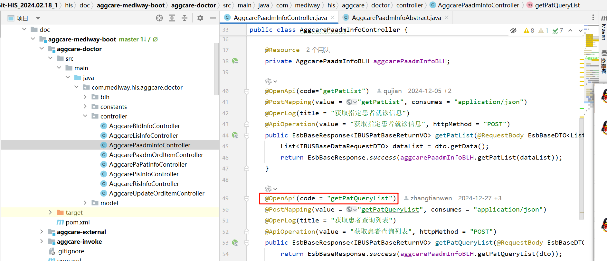


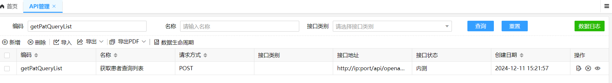

## 17.2 第三方系统


