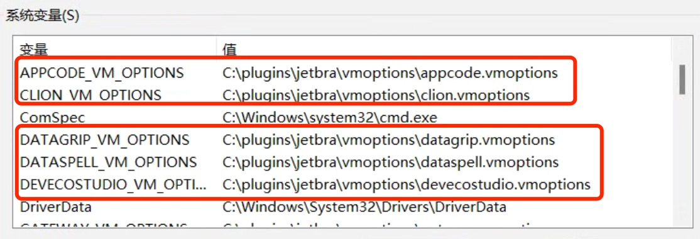
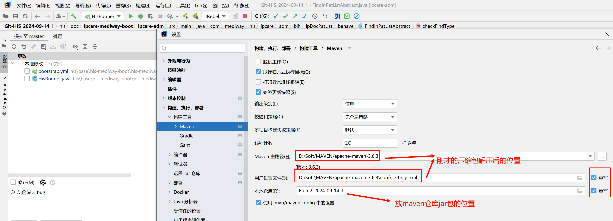
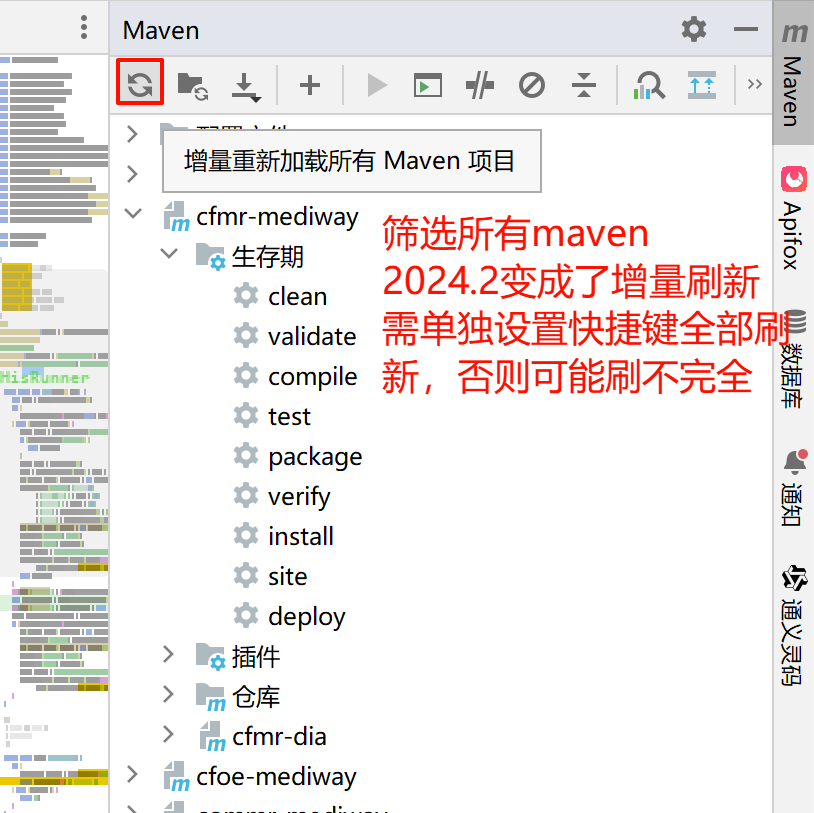
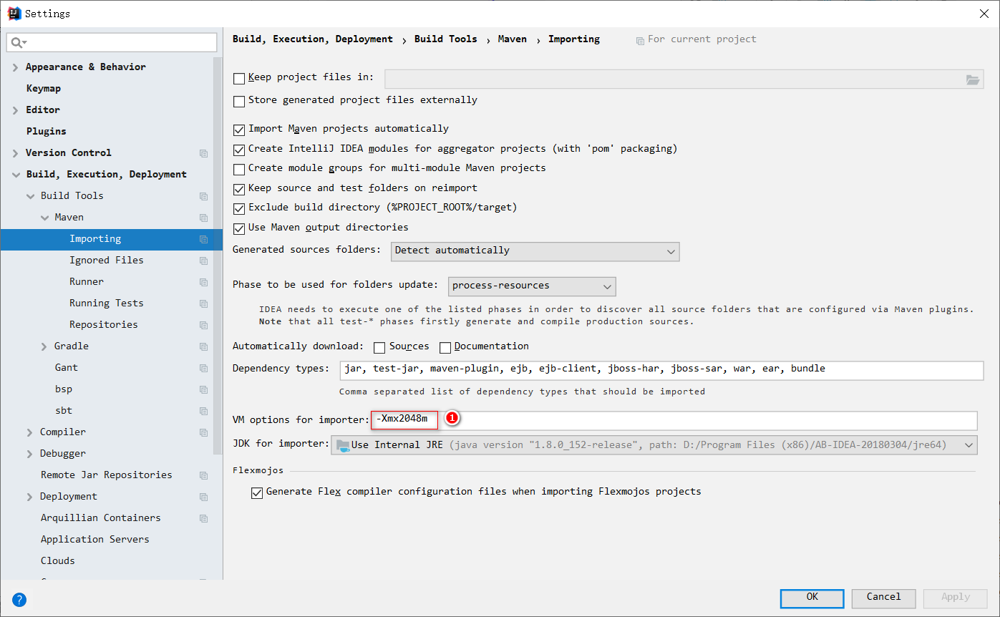

注：
- 文档中有些文档或软件没有提供，需单独提供

# 1 Git
## 1.1 申请账号

目前公司git账号需让谭工申请，申请下来的账号初始密码【12345678】
也可用自己的账号，但要改名为姓名全拼，向谭工申请医生站gitlab权限

# 2 git地址
https://106.63.4.7:8000/

## 2.1 git克隆注意事项
- git文件目录不能有空格，影响nginx代理
- git一般有git地址和https两种地址克隆
- idea一次性拉取多个模块，用git地址容易出现拉取失败【<font color="#ff0000">建议用https地址</font>】
- hisfront前端克隆耗时会非常长，约 **1 小时 7 分钟**，需注意
- 如果网络受限或提交记录过多【如hisfront前端】，可配置 Git 代理或使用 `--depth 1` 仅克隆最新提交
`git clone --depth 1 <Git地址>.git`

## 2.2 GitLab有git和https两种克隆方式
### 2.2.1 GitLab认证方式
- **如果你使用 HTTPS**：建议使用 **个人访问令牌（Personal Access Token）**。
- **如果你使用 GIT**：建议使用 **SSH 密钥**，这通常更安全且不需要输入密码。
- **如果你使用 GitLab 插件**：可以选择 **OAuth** 认证，但这个方式不如前两种常见。

### 2.2.2 用git地址克隆
**使用 SSH 秘钥克隆仓库**【百度】
git@106.63.4.7:8000/his-mediway-java/backend/base/his-mediway-boot.git
git@106.63.4.7:8000/his-mediway-java/backend/base/hiscore-mediway-boot.git
……

### 2.2.3 用https地址克隆
**建议用访问令牌**【百度】
1. 登录 GitLab，进入 `Settings` → `Access Tokens`。
2. 输入令牌名称（如 `my-token`），选择权限（如 `read_repository`）。
3. 设置过期时间（可选），点击 `Create personal access token`。
4. **复制生成的令牌**（只会显示一次）。

#### 2.2.3.1 简略步骤【在gitbash或cmd执行】
- **禁用 SSL 验证** 
- 因为远端服务器使用的是自签名证书，而不是由受信任的证书颁发机构（CA）签发的证书。Git 无法信任该证书，会导致连接失败
git config --global http.sslVerify false

- 存储第一次输入的用户名+访问令牌，并在下次使用时自动认证
git config --global credential.helper store

- 第一次克隆git
```
git clone https://<username>:<token>@<host>:<port>/<path>
<username> Git 账户名，默认是邮箱@前内容
<token> 访问令牌
<host> Git 服务器地址
<port> 端口号
<path> 具体地址

如
git clone https://<账户名>:<访问令牌>@106.63.4.7:8000/his-mediway-java/front/hisfront.git
```
- 以后的其他模块克隆
https://106.63.4.7:8000/his-mediway-java/backend/base/his-mediway-boot.git
https://106.63.4.7:8000/his-mediway-java/backend/base/hiscore-mediway-boot.git
……

可使用后端相关git克隆批处理文件
[后端代码](assets/!信创库简单入门-环境安装与常用地址/后端代码.bat)
前端单独拉取
https://106.63.4.7:8000/his-mediway-java/front/hisfront.git
mremr 为过时模块，直接忽略
https://106.63.4.7:8000/his-mediway-java/backend/mremr/mremr-mediway-boot.git

#### 2.2.3.2 拉取分支master
观察拉取分支是否为master分支，不是需要修改
如果有其他分支请用远程里的master分支checkout


### 2.2.4 修改已拉取git地址的方法【基础平台】
如从git改为https，或由http改为https
https://106.63.4.7:8000/his-mediway-java/his-document/-/blob/master/git/%E6%9B%B4%E6%94%B9%E6%9C%AC%E5%9C%B0%E4%BB%93%E5%BA%93%E5%AF%B9%E5%BA%94%E7%9A%84%E8%BF%9C%E7%A8%8B%E4%BB%93%E5%BA%93%E5%9C%B0%E5%9D%80.md

### 2.2.5 IDEA访问令牌配置


## 2.3 推荐布局

每个模块文件夹放置位置随意，以上目录布局只是建议
【不需要的模块可以不下载到本地，或不在一个idea中运行】

## 2.4 job定时任务模块
https://106.63.4.7:8000/his-mediway-java/backend/common/job-mediway-boot.git

如果用IDEA打开的文件下，同时有job和其他模块，用单体启库会失败

# 3 87测试环境说明文档
https://106.63.4.7:8000/his-mediway-java/his-document/-/blob/master/%E7%8E%AF%E5%A2%83%E8%AF%B4%E6%98%8E%E6%96%87%E6%A1%A3/%E6%B5%8B%E8%AF%95%E7%8E%AF%E5%A2%83%E8%AF%B4%E6%98%8E%E6%96%87%E6%A1%A3.md

# 4 Jenkins
**功能**：对Git仓库拉取最新的代码并进行编译、打包，发送到maven仓库，自动启动构建任务等

- 84 Jenkins
http://119.255.194.84:8090/view/all/
构建各模块代码+重启84库(通过重构建his-mediway-boot实现)
医生站主要模块综合 doctorPipeline_Customize

- 87 Jenkins
http://82.156.50.202:8082/
重启87库，通过重构建his-mediway-boot实现

相关账号，自行在网页注册即可

# 5 IDEA【集成开发环境IDE】
## 5.1 简单比较
建议使用IDEA开发

| 特性       | IntelliJ IDEA (IDEA)            | Eclipse               |
| -------- | ------------------------------- | --------------------- |
| 界面设计     | 现代、简洁、直观                        | 过时，较为复杂               |
| 性能       | **内存占用较高，启动较慢**                 | 相对较轻，启动速度快            |
| 插件支持     | 插件较少，但功能强大<br>                  | 插件丰富，几乎支持所有开发需求       |
| 代码补全智能提示 | 非常智能和精准                         | 相对较弱，功能不如 IDEA 强大     |
| 支持的语言和框架 | 多语言支持较好，如 Kotlin、Scala、Groovy 等 | 主要支持 Java，但也支持其他语言和框架 |
| 重构功能     | 强大的重构工具                         | 基本的重构功能               |
| 更新与支持    | 更新频繁，支持最新技术                     | 更新较慢，支持较老技术           |
| 开发效率     | 高效，尤其对于 Java 开发                 | 较为繁琐，适合多语言/跨平台开发      |
| 价格       | 免费版与收费版（Ultimate 版）             | 完全免费                  |

## 5.2 下载地址
IDEA下载地址
https://www.jetbrains.com/idea/download/other.html
不必用太高版本，个人建议2024.1.7【推荐】 或 2024.2.5
最新版2024.3 有bug
一台电脑同时安装多个大版本
如2024.1、2024.2、2024.3分属不同大版本

## 5.3 激活【jetbrains-crack.exe】
单文件【优先用】
[jetbrains-crack](assets/!信创库简单入门-环境安装与常用地址/jetbrains-crack.exe)
安装版
[jetbrains-crack_1.0.0_x64-setup](assets/!信创库简单入门-环境安装与常用地址/jetbrains-crack_1.0.0_x64-setup.exe)

- 工具【JetBrains IDEs】
	- 支持激活IDEA + 多数插件
	- 已知不能激活插件：JetBrains Al Assistant、彩虹括号


- 默认使用绿色版【jetbrains-crack.exe】
- 如果鼠标放图标按钮处，如果没有相关功能提示
	使用安装版【jetbrains-crack_1.0.0_x64-setup.exe】

### 5.3.1 使用说明

- 安装IDEA：
	- <font color="#ff0000">打开IDEA</font>自动进入激活许可证界面
	- 什么都不做，<font color="#ff0000">直接退出IDEA</font>
	- 这步主要是为了让JetBrains能检测到IDEA
- 按上图使用【JetBrains IDEs】一键激活

### 5.3.2 激活失败：
#### 5.3.2.1 【JetBrains IDEs】提示失败原因


#### 5.3.2.2 采用过其他激活方式如vbs，环境变量里有如下内容




可执行原激活文件夹下的 uninstall-all-users.vbs 或 uninstall-current-user.vbs 卸载 
 

#### 5.3.2.3 mac 提示文件损坏
命令行执行 sudo xattr -rd com.apple.quarantine /Applications/jetbrains-crack.app

### 5.3.3 JetBrains激活原理
- 软件工作原理
	- ja-netfilter
	- 目前查到的激活方式都是依赖【ja-netfilter】激活，只是形式有所不同
- 软件技术
	- Tauri + React + Rust
- 依赖环境
	- WebView2 Runtime

## 5.4 更新版本

当更新版本时，解决方案选择【保留】，可保留激活状态

## 5.5 推荐配置
### 5.5.1 保存时格式化


## 5.6 加载js文件各种报错提示


## 5.7 IDEA插件


GenerateAllSetter：一键生成实体对象的Set、Get属性
- 使用方式：在实体对象Ctrl+Enter  

## 5.8 JRebel热部署激活 
### 5.8.1 方案一
https://blog.csdn.net/qq251708339/article/details/134105044

### 5.8.2 方案二
https://blog.csdn.net/Z_Lisa/article/details/127263571
如果过期需要重新激活
个人在一年后过期
https://blog.csdn.net/ITgirl1/article/details/112315570
https://www.guidgen.com/
f70c1303-2bfd-471f-9c3d-d8e3a44dcb48

## 5.9 常见问题
### 5.9.1 jrebel with debug启库报错，run with jrebel和其他模式启库正常【未解决】
#### 5.9.1.1 方案一：项目结构-模块
找到项目启动项的模块
设置使用相对路径，重新生成下jrebel的xml文件

#### 5.9.1.2 方案二：修改Reactive Streams


# 6 Maven
## 6.1 maven仓库
apache-maven-3.6.3 配置里维护
http://119.255.194.80:8081/repository/maven-public

网页查看【仅用于确认最新版本号，比较难用，不建议】
84
http://119.255.194.80:8081/#browse/browse
87
http://81.70.204.46:8081/#browse/browse
用户名：guest
密码：guest

原私服地址：http://119.255.194.80:8081/
新私服地址：http://81.70.204.46:8081/

## 6.2 IDEA中Maven配置
建议版本：apache-maven-3.6.3【其他高版本似乎可用，自行决定】
apache-maven-3.6.3/conf/settings.xml
[settings](assets/!信创库简单入门-环境安装与常用地址/settings.xml)


## 6.3 添加为Maven项目
每个模块都需要加入Maven【一般需要手动添加】


## 6.4 刷新maven




### 6.4.1 配置快捷键【针对2024.2及以上版本】


# 7 启库内存不足
## 7.1 内存不足处理
刷新Maven报错：<font color="#ff0000">java.lang.OutOfMemoryError: GC overhead limit exceeded</font>
https://blog.csdn.net/goodjava2007/article/details/122097086
[IDEA内存不足](../../Java/IDEA/IDEA内存不足.md)



具体内存大小根据电脑实际情况配置

## 7.2 项目构建时提示内存不足

修改共享堆

# 8 前后端代理 nginx
官网选择较新版本即可
https://nginx.org/en/download.html

## 8.1 配置文件
nginx-1.27.3/conf/nginx.conf
[nginx](assets/!信创库简单入门-环境安装与常用地址/nginx.conf)

配置简要说明
https://106.63.4.7:8000/his-mediway-java/front/hisfront

启库成功后，本地登录地址由nginx决定
如上图，前端登录地址为 http://localhost:8091/his/base 或 http://127.0.0.1:8091/his/base

# 9 启库前修改bootrap.yml
## 9.1 env：由dev改为test
dev连的是84数据库
test连的是87数据库
目前开发重心转移到87数据库


## 9.2 减轻服务器内网压力【5M】
bootstrap.yml：
	config-common-serveraddress.yml
	改为
	config-common-serveraddress-local.yml


# 10 单体启库


# 11 启库报错
### 11.1.1 缺少posyspath目录

如这种，需在C盘 用户目录下，建 posyspath 文件夹


# 12 IDEA未加载本地class，而加载jar的处理方法
设置-项目管理-库，Ctrl+F 搜索相关包名-删除
可多选同时删除


# 13 nacos【不要随意改动】
84 nacos  
http://81.70.230.87:8848/nacos/#/configurationManagement?dataId=&group=&appName=&namespace=dev&pageSize=&pageNo=&namespaceShowName=dev  
87 nacos  
http://81.70.230.87:8848/nacos/#/configurationManagement?dataId=&group=&appName=&namespace=test&pageSize=&pageNo=&namespaceShowName=test  
目前放在同个ip不同配置列表  
主要是用来配置库相关信息，包括连接数据库，各种服务连接地址等  

# 14 任务调度中心
84
http://119.255.194.84:8084/xxl-job-admin/
87
http://81.70.229.8:6398/xxl-job-admin/
admin
123456

任务调度中心配置教程：
https://bilibili.com/video/BV1824y1G7vT/?p=6&vd_source=e433193b0d5562f1de15eb61c86f94f9

# 15 前端登录
84库  
http://119.255.194.84:8082/his/base/  
87库  
http://81.70.230.87:8091/his/base  
84：泰安某台服务器？一般不用了  
87：数据库是腾讯云服务器，主要在用，速度上要比84好，实际体验，都很一般

信创主要工号
	admin【所有界面权限，但没有院区科室，不建议用】
	demo【主要用】
	ar【门诊挂号收费】
	arip【住院挂号收费】
	ys01【门诊医生】
	ys02、ys03【住院医生】
	yk【药库】
	jzys01【急诊医生01】
除了ys01密码为 111，其他工号密码均为 111111

# 16 连数据库【建议DBeaver】
选择PostgreSQL，不建议用KingBase驱动
DBeaver支持连iris、cache数据库


## 16.1 DBeaver


## 16.2 IDEA自带数据库

数据库工具，建议DBeaver，IDEA自带数据库都可以

IDEA数据库
- 优点：比DBeaver连接速度更快
- 缺点：没有表格化视图

 数据库驱动用PostgreSQL，不要用Kingbase

## 16.3 87数据库地址【腾讯云服务器】
jdbc:postgresql://82.157.98.223:5432/ho_his
系统用户
	system
    DHCC#2024&;]
医生站接用户
	doctor
	d9WtEbExs

# 17 87库重启时间
每天
	上午五点半
	中午一点
	下午六点四十五分