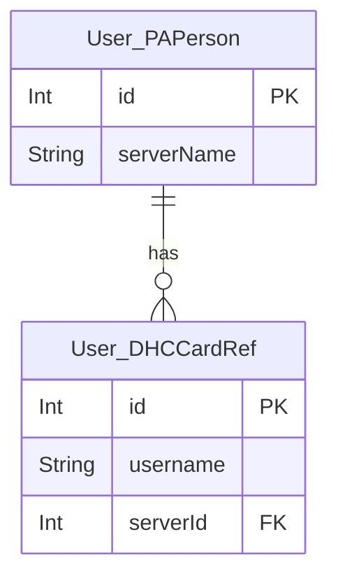

# card reg

User.PAPatMas
User.DHCPAPatMas

User.PAPerson
User.DHCPerson

User.PersonAdmInsurance
User.AdmInsurance

User.DHCPAPatMas
User.DHCPerson 
User.DHCCardRef
User.DHCAccManager
User.CardPATRegConfig
User.DHCHardComManager

# reg

User.RBApprSchedule
User.PAAdm
User.PAAdmExt

User.RBAppointment
User.DHCRBAppointment
User.DHCLocSpec

User.DHCINVOICE
User.DHCINVPRT
User.DHCINVPayMode

# mr

User.MRAdm
User.MRDragons

# oe

User.OEOrder
User.OEOrdItem
User.DHCOEOrdItem

User.OEOrdStatus
User.OEOrdExec

# queue

DHCQueue

DHCQueueStatus

PerState

///^PAADMi("No",$$ALPHAUP({PAADM_ADMNo}),{PAADM_RowID})
///^User.DHCQueueI("QuePaadmDrIndex",QuePaadmDr)